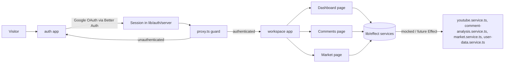

## EnsiEssay – Creator Intelligence Workspace

EnsiEssay is an authenticated workspace for YouTube creators that turns channel data, comments, and market signals into an actionable &quot;essay&quot; on what to publish next. The motive is to move beyond dashboards and give a fast read on audience sentiment, content performance, and market direction in one place.

## Architecture

-   **App router layout**
    -   `app/(auth)`: sign-in / sign-up surfaces using Better Auth.
    -   `app/(app)`: authenticated workspace (`dashboard`, `comments`, `market`) behind a proxy guard.
-   **Auth**
    -   [`better-auth`](https://www.better-auth.com/) with a Google OAuth provider and YouTube scopes.
    -   Server config + session helpers in `lib/auth/` and API route in `app/api/auth/[...better-auth]/route.ts`.
-   **Effect-style service layer**
    -   Pure, typed service modules in `lib/effect/` (`youtube.service.ts`, `comment-analysis.service.ts`, `market.service.ts`, `user-data.service.ts`) with mocked implementations.
    -   A small `runtime` helper that is ready to be swapped to real [`effect`](https://effect.website) usage later.
-   **Routing protection**
    -   `proxy.ts` enforces that all `/(app)` routes require an authenticated session and redirects to `/(auth)/sign-in` otherwise.



## Packages

-   **Runtime / framework**
    -   `next` (App Router), `react`, `react-dom`.
-   **Auth**
    -   `better-auth` and `better-auth/next-js` for server + client adapters.
-   **Environment**
    -   `@t3-oss/env-core` and `zod` for a typed `env.ts` schema (Google OAuth keys, `NODE_ENV`, etc.).
-   **Experiments / services**
    -   `effect` (planned) for future effectful service implementations behind the existing typed interfaces in `lib/effect/`.

## Setup

1. **Install dependencies**

    ```bash
    pnpm install
    ```

2. **Environment variables**

    Configure a `.env.local` compatible with `env.ts`:

    - `NODE_ENV`
    - `GOOGLE_CLIENT_ID`
    - `GOOGLE_CLIENT_SECRET`
    - Any additional Better Auth or YouTube-related secrets you introduce later.

3. **Run the dev server**

````bash
pnpm dev
    ```

    Then open `http://localhost:3000`.

## Development notes

-   Client-side auth flows use the Better Auth React client in `lib/auth/client.ts` from the `app/(auth)` pages.
-   The `lib/effect/*` modules currently return mocked data; you can replace their internals with real Effect programs without changing the UI layer.
-   Keep new modules typed and avoid `any` / `undefined` in TypeScript; extend the existing domain types instead.

## Further reading

-   `packages-and-setup.md`: short reference for core dependencies and pnpm commands.
````
